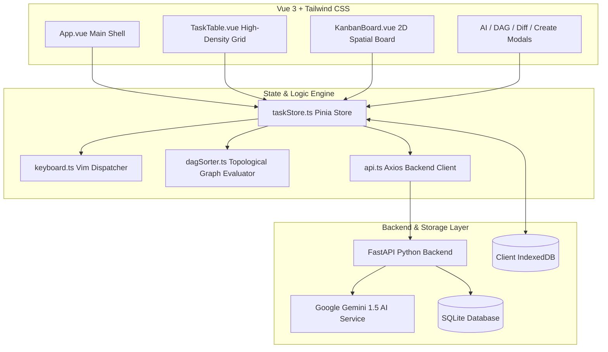

# KOSHI (輿)

> **High-Velocity, Local-First Project Management System**  
> *Deterministic State Machines • Vue 3 Composition API & Pinia • 2D Spatial Vim Navigation • Topological DAG Prioritization • Schema-Constrained AI Execution*

[](https://koshi.felixsu.qzz.io)
[](https://vuejs.org)
[](#)
[](#)
[](#)
[](./URD_SRS.md)

---

## 1. Executive Summary & Problem Statement

Modern Project Management tools (Jira, Notion, ClickUp, Linear) have succumbed to feature bloat, memory leakages, administrative state-machine overhead, and superficial LLM wrappers. 

```
┌───────────────────────────────┐     ┌───────────────────────────────┐
│     Contemporary PM Tools     │     │             KOSHI             │
├───────────────────────────────┤     ├───────────────────────────────┤
│ 800MB–2GB+ RAM per Electron   │     │ <15MB RAM Idle Web / Mobile   │
│ 1.5s+ modal latency & Diffing │     │ <16ms Optimistic Mutations    │
│ 15–30 mandatory JQL fields    │     │ 4 Strict Deterministic States │
│ Unconstrained hallucinated AI │     │ Schema-Enforced AI Services   │
│ Proprietary CSV lock-in       │     │ Lossless Graph JSON Port      │
└───────────────────────────────┘     └───────────────────────────────┘
```

**KOSHI** eliminates these systemic bottlenecks by operating on five strict architectural principles:
1. **Vue 3 Composition API & Pinia Reactivity**: Fine-grained reactive state and zero visual lag.
2. **Modal-Less 2D Vim Keyboard Traversal**: High-velocity hotkeys (`b` view toggle, `h`/`j`/`k`/`l` spatial grid navigation, `H`/`L` lateral card shifts, `Space` cyclic status cycling, inline `Enter` edits).
3. **Deterministic State Transitions**: Cyclic invariant: `TODO` $\rightarrow$ `IN_PROGRESS` $\rightarrow$ `BLOCKED` $\rightarrow$ `DONE` $\rightarrow$ `TODO`.
4. **Topological DAG Prioritization**: Computes true critical paths mathematically instead of arbitrary story-point poker.
5. **Local-First Persistence**: Zero-latency IndexedDB offline persistence with seamless background FastAPI backend synchronization.

---

## 2. Core Architecture & Tech Stack



* **Frontend**: Vue 3 + Pinia + TypeScript + Vite + Tailwind CSS.
* **Backend**: FastAPI (Python 3.11) + SQLAlchemy 2.0 + Google Gemini AI.
* **Storage**: IndexedDB (`idb-keyval`) locally, SQLite / PostgreSQL on server.
* **Deployment**: Docker Compose (Nginx + Uvicorn) behind Caddy reverse proxy on `umi`.

---

## 3. High-Leverage Deterministic AI Integration

KOSHI replaces conversational chat wrappers with structured AI services:

### 3.1. Task Decomposer
Transforms unstructured engineering goals into structured, dependency-linked subtask graphs with complexity ratings.

### 3.2. Weekly Progress Summary
Generates structured executive summaries categorizing completed milestones, active bottlenecks, and immediate sprint priorities.

### 3.3. Meeting Minutes Generator
Parses conversational meeting transcripts to extract attendees, recorded decisions, key discussions, and auto-generated actionable tasks.

### 3.4. Team Workload & Smart Assignment
Evaluates developer skill matches, current active WIP count, and complexity points to balance team velocity.

### 3.5. Git Diff State Synchronizer
Parses Unified Git Diffs and commit messages (e.g. `feat: resolve #TSK-101`) to automatically transition task states.

### 3.6. Topological DAG Critical Path Evaluator
Constructs an adjacency graph of task dependencies, checks for circular dependencies via Kahn's algorithm, and computes the longest complexity-weighted path ($S=1, M=2, L=3, XL=5$), flagging bottlenecks with the `Flame` indicator.

---

## 4. Keyboard Protocol & Touch Ergonomics

### 4.1. Desktop Keyboard Shortcuts
| Key | Action | Scope |
| :--- | :--- | :--- |
| `b` | Toggle Table / Kanban View | Global |
| `h` / `l` / `←` / `→` | Move left / right between columns | Kanban view |
| `j` / `k` / `↓` / `↑` | Move down / up across tasks / rows | Global |
| `H` / `L` | Shift selected task to adjacent status column | Kanban view |
| `Space` | Cycle task status (`TODO` $\rightarrow$ `IN_PROG` $\rightarrow$ `BLOCKED` $\rightarrow$ `DONE` $\rightarrow$ `TODO`) | Active task |
| `Enter` | Inline title edit mode | Active task |
| `d` / `Backspace` | Delete selected task | Active task |
| `c` | Open task creation modal | Global |
| `1` - `4` | Set priority (`1`: LOW, `2`: MED, `3`: HIGH, `4`: CRITICAL) | Active task |
| `/` | Focus search filter | Global |
| `a` | Open Task Decomposer modal | Global |
| `g` | Open Git Diff analyzer modal | Global |
| `v` | Open Topological DAG visualizer | Global |
| `t` | Toggle Light / Dark mode (0ms snap) | Global |
| `?` | Open keyboard shortcuts help modal | Global |
| `Esc` | Cancel edit / dismiss modal / unfocus search | Global (Capture-phase) |

---

## 5. Specification Documents

Detailed requirement matrices, IEEE 29148 functional specifications, and non-functional guarantees are maintained in [URD_SRS.md](./URD_SRS.md).

---

## 6. Development & Deployment

### 6.1. Local Development
```bash
# Frontend
pnpm install
pnpm run dev

# Backend
cd backend
python -m venv .venv
source .venv/bin/activate
pip install -r requirements.txt
uvicorn app.main:app --reload --port 8000
```

### 6.2. Production Build
```bash
pnpm run build
```

---

## 7. License & Authorship

Developed by **Felix Anderson** (`me@felixsu.qzz.io`).  
Released under the **MIT License**.
