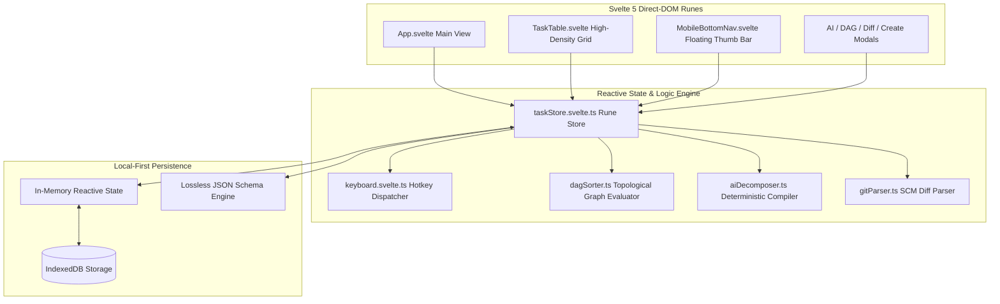

# KOSHI (輿)

> **High-Velocity, Local-First Project Management System**  
> *Deterministic State Machines • Svelte 5 Direct-DOM Runes • Topological DAG Prioritization • Schema-Constrained AI Execution*

[](https://koshi.felixsu.qzz.io)
[](https://svelte.dev)
[](#)
[](#)
[](#)

---

## 1. Executive Summary & Problem Statement

Modern Project Management (PM) tools (Jira, Notion, ClickUp, Linear) have succumbed to feature bloat, memory leakages, administrative state-machine overhead, and superficial LLM wrappers. 

```
┌───────────────────────────────┐     ┌───────────────────────────────┐
│     Contemporary PM Tools     │     │             KOSHI             │
├───────────────────────────────┤     ├───────────────────────────────┤
│ 800MB–2GB+ RAM per Electron   │     │ <15MB RAM Idle Web / Mobile   │
│ 1.5s+ modal latency & Diffing │     │ <50ms Optimistic Mutations    │
│ 15–30 mandatory JQL fields    │     │ 4 Strict Deterministic States │
│ Unconstrained hallucinated AI │     │ Schema-Enforced AI Compiler   │
│ Proprietary CSV lock-in       │     │ Lossless Graph JSON Port      │
└───────────────────────────────┘     └───────────────────────────────┘
```

**KOSHI** eliminates these systemic bottlenecks by operating on five strict architectural principles:
1. **Svelte 5 Direct-DOM Reactivity**: Eliminates virtual DOM diffing via granular runes (`$state`, `$derived`).
2. **Modal-Less Keyboard Traversal**: Full Vim/Linear ergonomics (`j`/`k` nav, `Space` status cycling, inline `Enter` edits).
3. **Deterministic State Transitions**: Cyclic invariant: `TODO` $\rightarrow$ `IN_PROGRESS` $\rightarrow$ `BLOCKED` $\rightarrow$ `DONE` $\rightarrow$ `TODO`.
4. **Topological DAG Prioritization**: Computes true critical paths mathematically instead of arbitrary story-point poker.
5. **Local-First Persistence**: Zero-latency IndexedDB offline persistence with lossless JSON backup/restore.

---

## 2. Core Architecture & Tech Stack



* **Framework**: Svelte 5 (Runes) + TypeScript + Vite.
* **Styling**: Native Tailwind CSS utility classes (zero heavyweight third-party UI libraries).
* **Storage**: IndexedDB (`idb-keyval`) with synchronous in-memory rune caching.
* **Packaging**: Docker (Alpine + Nginx) container deployed behind Caddy reverse proxy.

---

## 3. High-Leverage Deterministic AI Integration

KOSHI replaces conversational chat wrappers with deterministic, schema-enforced compilers:

### 3.1. AI Task Decomposition Compiler (`aiDecomposer.ts`)
Transforms unstructured engineering goals into dependency-linked subtask graphs:
```json
{
  "goal": "Implement JWT Auth State Machine",
  "rationale": "Decomposing authentication workflow into token schemas, middleware, and route guards.",
  "subtasks": [
    {
      "title": "Define Auth State Machine & Token Schema",
      "description": "Implement token schemas and refresh lifecycles.",
      "priority": "HIGH",
      "complexity": "M",
      "acceptanceCriteria": ["Valid signature check", "Auto-refresh on 401"],
      "dependsOnTitles": []
    }
  ]
}
```

### 3.2. Git Diff State Synchronizer (`gitParser.ts`)
Parses commit messages and diff headers (e.g. `feat(auth): resolve #TSK-101`) to automatically close tickets and flag unaddressed edge cases.

### 3.3. Topological DAG Critical Path Evaluator (`dagSorter.ts`)
Constructs an adjacency graph of task dependencies, checks for circular cycles via Kahn's algorithm, and computes the longest execution path weighted by complexity ($S=1, M=2, L=3, XL=5$), flagging true project bottlenecks with the `Flame` indicator.

---

## 4. Keyboard Protocol & Touch Ergonomics

### 4.1. Desktop Keyboard Shortcuts
| Key | Action | Scope |
| :--- | :--- | :--- |
| `j` / `↓` | Select next task | Table navigation |
| `k` / `↑` | Select previous task | Table navigation |
| `Space` | Cycle task status (`TODO` $\rightarrow$ `IN_PROG` $\rightarrow$ `BLOCKED` $\rightarrow$ `DONE`) | State mutation |
| `Enter` | Inline title edit mode | Active row |
| `d` | Delete selected task | Active row |
| `c` | Open task creation modal | Global |
| `1` - `4` | Set priority (`1`: LOW, `2`: MED, `3`: HIGH, `4`: CRITICAL) | Active row |
| `/` | Focus search bar | Global |
| `a` | Open AI Decomposer modal | Global |
| `g` | Open Git Diff analyzer modal | Global |
| `v` | Open Topological DAG visualizer | Global |
| `?` | Open shortcuts help modal | Global |
| `Esc` | Cancel edit / dismiss modal / unfocus search | Global |

### 4.2. Mobile Touch Gestures
* **Tap Status Badge**: Cycle state instantly.
* **Double-Tap Title**: Enter inline edit mode.
* **Swipe Right ($>75\text{px}$)**: Mark task `DONE`.
* **Swipe Left ($<-75\text{px}$)**: Flag task `BLOCKED` / Delete.
* **Floating Bottom Thumb Bar**: 5 tactile actions (`Search`, `AI`, `+ New`, `DAG`, `Diff`).

---

## 5. Honest Evaluation & Technical Drawbacks

| Dimension | Strength in Koshi | Drawback / Limitation | Mitigation Roadmap |
| :--- | :--- | :--- | :--- |
| **Multi-User Collaboration** | Instant single-player speed; zero server dependency. | No real-time multi-user CRDT synchronization (single-device local state). | Integrate Yjs / Automerge over WebSockets for multi-peer syncing. |
| **AI Processing** | Zero-latency, deterministic schema output; zero hallucinations. | Offline heuristics cannot process open-ended domain queries without cloud LLMs. | Add optional OpenAI/Ollama API endpoint hook with structured JSON mode. |
| **Storage Persistence** | Fast IndexedDB local-first storage; lossless JSON backup. | Browser cache clearing purges unexported state. | Implement Origin Private File System (OPFS) SQLite WASM backend. |
| **Media Attachments** | Ultra-lightweight memory footprint ($<15\text{MB}$). | No binary image/video hosting inside tasks. | Add S3/Blob storage link attachment support. |

---

## 6. SDLC Traceability & Verification Matrix

* **KT1 (Domain & Schema Design)**: Implemented typed task entity model with 4-state deterministic transitions, metadata fields, and IndexedDB persistence.
* **KT2 (Reactive CRUD & Telemetry)**: Built Svelte 5 Direct-DOM table view with sub-50ms optimistic updates and real-time latency/RAM telemetry.
* **KT3 (AI Prompts & Conflict Resolution)**: Engineered AI goal decomposer, Git diff synchronizer, and topological DAG critical-path algorithm.
* **Cuối kỳ (Deployment & Deliverables)**: Production container packaged with Alpine/Nginx and deployed at `https://koshi.felixsu.qzz.io`.

---

## 7. Development & Deployment

### 7.1. Local Development
```bash
# Install dependencies
npm install

# Start Vite development server
npm run dev
```

### 7.2. Production Build
```bash
# Build optimized static assets
npm run build
```

### 7.3. Docker Container Deployment
```bash
# Build Docker image
docker build -t koshi:latest .

# Run container behind proxy (port 80)
docker run -d --name koshi -p 8080:80 koshi:latest
```

---

## 8. License & Authorship

Developed by **felixsu** (`me@felixsu.qzz.io`).  
Released under the **MIT License**.
