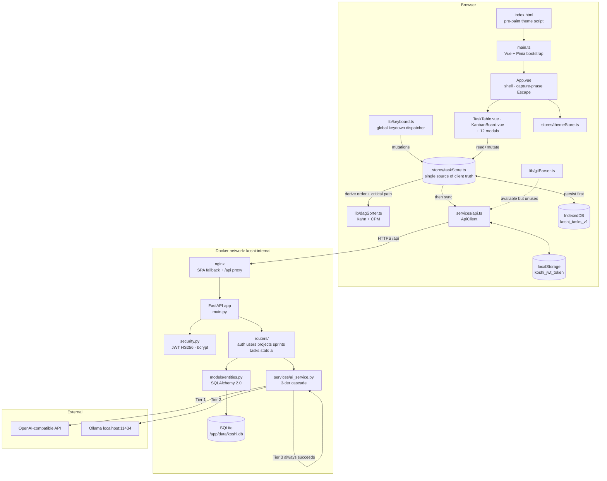
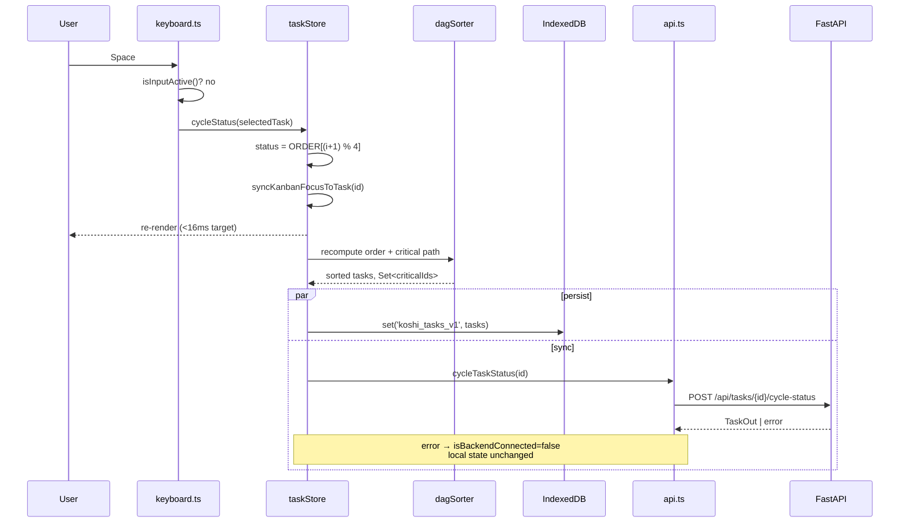

# D3 — Architecture

**Purpose:** how the parts interact, where the boundaries are, and which direction data flows.
**Last verified against code:** 2026-08-28 (rev 2 — per-project roles)

---

## 1. Architectural style

Koshi is a **local-first two-tier application**. The client is the primary system of record for the
interactive session; the server is a durability and intelligence tier. This inverts the usual
web-app assumption and explains most of the design:

1. **The client never blocks on the network.** Every mutation lands in Pinia state and IndexedDB
   first. Network calls are fire-and-forget follow-ups.
2. **The server never assumes it is reachable.** Every AI endpoint degrades to a deterministic
   generator rather than erroring.
3. **Algorithms live client-side.** Topological sort and critical path run in the browser on the
   full task set, so they cost nothing and work offline.

## 2. Runtime topology



## 3. Layering rules

Dependencies point **downward only**. A violation is a defect.

```
      components/*.vue          may import stores, types, lib
              │
              ▼
        stores/*.ts             may import lib, services, types
              │
      ┌───────┴───────┐
      ▼               ▼
   lib/*.ts       services/*.ts     may import types ONLY
      │               │
      └───────┬───────┘
              ▼
         types/task.ts           imports nothing
```

**Invariants:**
- `lib/` must stay free of Vue and network imports. It is pure and synchronous — which is what let
  `dagSorter.test.ts` be written with no mocking at all. Keep new algorithms here for the same
  reason.
- Components must not call `services/api.ts` directly; they go through `taskStore`. (Auth modal is
  the one accepted exception.)
- On the server: `routers/` → `services/` + `models/` + `schemas/`. `services/` must never import
  `routers/`.

## 4. The three critical interaction flows

### 4.1 Keystroke → rendered state (the hot path, NFR-01)

```
keydown (document)
   └─ App.vue capture-phase listener  ─── Escape? ──▶ dismiss & stop
   └─ lib/keyboard.ts dispatcher
        ├─ isInputActive()? ──▶ abort (FR-INT-10)
        └─ switch(key) ──▶ taskStore.<action>()
                              ├─ mutate reactive array   ──▶ Vue re-render (synchronous)
                              ├─ set(DB_KEY, tasks)      ──▶ IndexedDB (async, unawaited)
                              └─ api.<method>()          ──▶ network (async, failure tolerated)
```

The DOM update is complete before either async branch resolves. **This ordering is the architecture.**
Awaiting persistence or network before rendering would violate NFR-01 and FR-PERS-02 simultaneously.

### 4.2 Boot and reconciliation

```
main.ts → pinia → themeStore.init()          (theme already applied by index.html script)
App.vue onMounted
   ├─ taskStore.load()
   │     ├─ get('koshi_tasks_v1') from IndexedDB
   │     └─ empty? seed from INITIAL_TASKS constant
   ├─ api.getToken() from localStorage
   └─ token present? api.getMe()
         ├─ 200 → currentUser set, isBackendConnected = true
         └─ fail → isBackendConnected = false, passive badge (FR-PERS-03)
```

There is **no merge algorithm**. Local IndexedDB state wins for the session. This is a known
limitation, not an oversight — see D1 §4.

### 4.3 An AI request

```
Component ──▶ api.<aiMethod>() ──▶ POST /api/ai/<feature>
                                       │ get_current_user (401 if absent)
                                       ▼
                                  routers/ai.py
                                       │ gathers DB context (tasks / users / workload)
                                       ▼
                                  AIService.<feature>()
                                       │ builds Vietnamese system+user prompt
                                       ▼
                                  AIService._call_llm()
                                       ├ Tier 1 OpenAI  — only if AI_API_KEY set AND "openai" in AI_API_URL
                                       ├ Tier 2 Ollama  — always attempted, 4 s budget
                                       └ Tier 3 _deterministic_fallback() — cannot fail
                                       ▼
                                  strip ``` fences → json.loads → on parse error, Tier 3 again
                                       ▼
                                  Pydantic response model validates (FR-AI-06)
```

The Pydantic response model at the boundary is what makes the AI output safe for downstream code:
whatever the model returns, the client receives a shape it can rely on.

## 5. Component interaction — status change, end to end



Note the **duplicated cycle logic**: the client advances the status *and* the server independently
advances it. Both implement the same 4-cycle (D4 §3.1). If they ever diverge, the client wins
visually and the server wins on reload — a real hazard tracked as RISK-04 in D6.

## 5b. Authorisation model

Authorisation is **relational, not attributive**: permission is not a property of a user, it is a
property of the (user, project) pair recorded in `project_members`.

```
User ──┬── ProjectMember{role: PM}     ──▶ Project "Apollo"
       └── ProjectMember{role: MEMBER} ──▶ Project "Zephyr"
```

The same account is therefore an administrator in one project and an ordinary contributor in
another, with no global role to reconcile.

Every project-scoped endpoint resolves the caller's membership before doing anything else:

```
request ──▶ get_current_user      (401 if the token is absent or invalid)
        ──▶ require_member(...)   (404 if the project is absent OR the caller is not a member)
        ──▶ require_project_pm()  (403 if the caller is a member but not a PM)
        ──▶ handler
```

Two deliberate choices in that ladder:

1. **Non-membership yields `404`, not `403`.** A `403` confirms the project exists. For a resource
   the caller has no right to know about, that is itself a disclosure, so unknown and forbidden are
   made indistinguishable.
2. **`403` is reserved for members who lack the *role*.** Once the caller is known to belong, there
   is nothing left to hide, and a precise error is more useful than a misleading one.

The client mirrors these rules for affordances only — `taskStore.isProjectManager` hides PM
controls. It is **not** a security boundary: the server re-checks every request independently, and
the tests in `test_projects_and_roles.py` assert the server refuses even when the UI would not have
offered the action.

## 5c. Schema ownership

Alembic owns the schema; the ORM describes it. The two must agree, and the app enforces that
differently per environment:

```
development           →  Base.metadata.create_all()   (fast local iteration)
anything else         →  _check_migrations_current()  (refuse to start unless at head)
```

`create_all` never alters an existing table, so it silently no-ops on a changed column — which is
precisely how a schema change can appear to work locally and corrupt a deployment. Outside
development the app therefore creates nothing and instead compares the database's Alembic revision
against the code's head, failing loudly with the exact command to run.

Existing databases that predate Alembic are onboarded by stamping the baseline:

```
alembic stamp 0001_initial_schema   # assert "my schema matches the pre-roles baseline"
alembic upgrade head                # then migrate forward normally
```

## 6. Deployment architecture

```
Internet
   │ TLS
   ▼
Caddy (host: umi, external network proxy-net)
   │
   ▼
koshi-frontend container ── nginx:alpine
   │   serves /usr/share/nginx/html (Vite build output)
   │   SPA fallback: try_files $uri /index.html
   │   proxies /api ──────────────┐
   │                              ▼
   └── network koshi-internal ── koshi-backend container
                                  uvicorn app.main:app :8000
                                  volume koshi-data → /app/data/koshi.db
```

Build contexts after the restructure:
- frontend image: context `.` (repo root), builds with `root: 'source/frontend'` → `dist/`
- backend image: context `./source/backend`

## 7. Key architectural decisions in force

| # | Decision | Consequence |
|:--|:--|:--|
| A1 | Client-first persistence ordering | Offline works; server/client convergence is not guaranteed. |
| A2 | Graph algorithms in the browser | Zero server load, works offline; does not scale past a few thousand tasks held in memory. |
| A3 | AI never fails hard (3-tier cascade) | Endpoints are always available; callers cannot distinguish real intelligence from canned text. |
| A4 | Pydantic schemas at the AI boundary | Downstream code is safe from malformed LLM output. |
| A5 | One global keydown dispatcher | Bindings are discoverable in one file; component-local shortcuts are impossible by design. |
| A6 | Dependencies stored as JSON TEXT, not a join table | Simple to write; graph queries cannot be pushed into SQL. Contradicts `db/schema.sql`. |
| A7 | Single Pinia store owns all task state | Trivial reasoning about mutations; the store is a 515-line change-magnet. |
